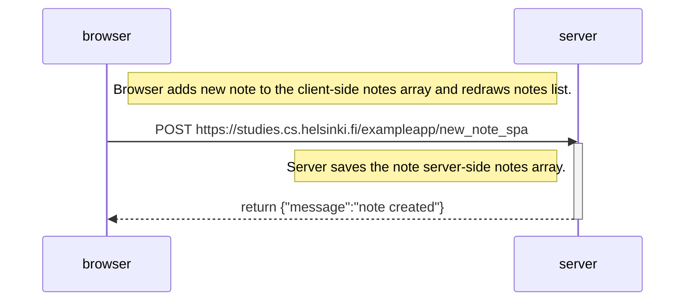

```mermaid
    sequenceDiagram
        participant browser
        participant server
        Note right of browser: Browser adds new note to the client-side notes array and redraws notes list.
        browser->>server: POST https://studies.cs.helsinki.fi/exampleapp/new_note_spa
        activate server
        Note left of server: Server saves the note server-side notes array.
        server-->>browser: return {"message":"note created"}
        deactivate server
```