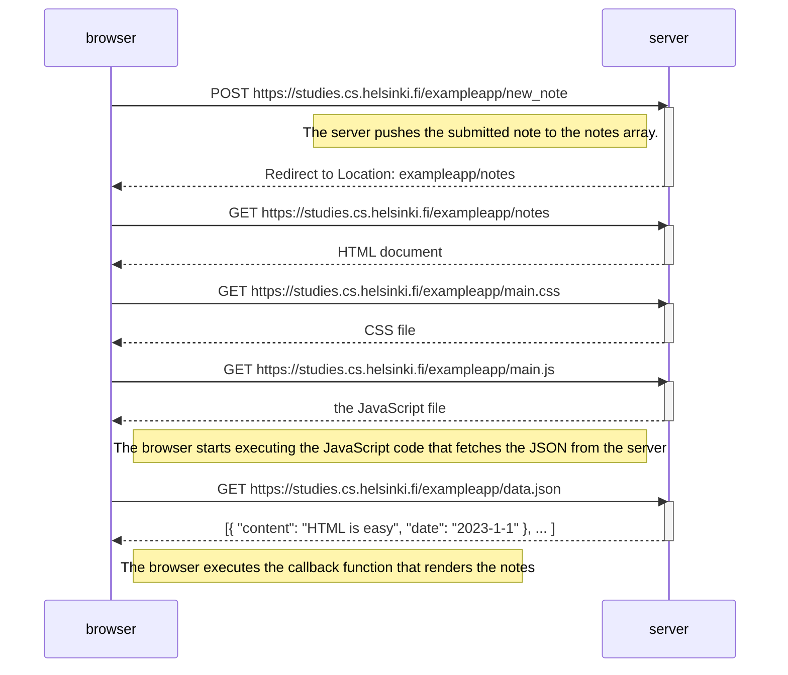

```mermaid
    sequenceDiagram
        participant browser
        participant server
        browser->>server: POST https://studies.cs.helsinki.fi/exampleapp/new_note
        activate server
        Note left of server: The server pushes the submitted note to the notes array.
        server-->>browser: Redirect to Location: exampleapp/notes
        deactivate server
        %% everything after this is re-doing what the app did on initial load
        browser->>server: GET https://studies.cs.helsinki.fi/exampleapp/notes
        activate server
        server-->>browser: HTML document
        deactivate server
        browser->>server: GET https://studies.cs.helsinki.fi/exampleapp/main.css
        activate server
        server-->>browser: CSS file
        deactivate server
        browser->>server: GET https://studies.cs.helsinki.fi/exampleapp/main.js
        activate server
        server-->>browser: the JavaScript file
        deactivate server
        Note right of browser: The browser starts executing the JavaScript code that fetches the JSON from the server
        browser->>server: GET https://studies.cs.helsinki.fi/exampleapp/data.json
        activate server
        server-->>browser: [{ "content": "HTML is easy", "date": "2023-1-1" }, ... ]
        deactivate server
        Note right of browser: The browser executes the callback function that renders the notes
```